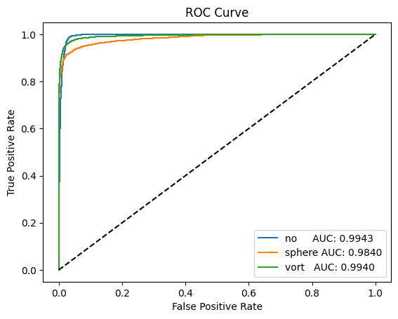

# ML4SCI - DEEPLENSE SUBMISSION GSoC 2024

This repository contains the code related to the various tasks for DeepLense Submission to ML4SCI for GSoC 2024

1. [Notebooks](Notebooks+) contains the Jupyter notebook containing  the implementation results for each task.
2. [Models](Models) contains model weights.
3. [Results](Results) contains plots and graphs related to the evaluation and output of the models

The following are the necessary outputs from the tasks

| Test | ROC-AUC Score | ROC Curve |
| ----------- | ------------- | --------- |
| Common Test | 0.993668 |  |
